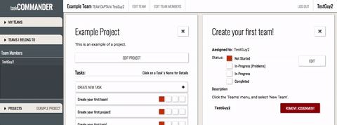
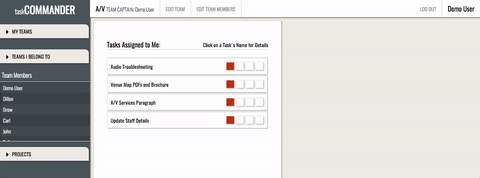

# TaskCommander
---------
A powerful project and task management app for teams. Built with a Rails 5 back-end and a React/Redux front-end.

[TaskCommander](https://taskcommander.herokuapp.com)

## Features
The design follows the principal Flux/React ideology of having a single source of *truth* (i.e. the master-state). Following this pattern gives rise to a few interesting scenarios.

### Change Once, Update Everywhere
There are quite a few times when it's useful to make a change on one a component in one part of an app and have those changes immediately show on a separate component in another part of the app. Consider the following animation:

How does this work?

Let's focus on the two active components: TaskListItem, and TaskListDetail. Both are *stateless* components. TaskListItem receives a Task JSON object from AllTaskListItems. TaskListDetail receives a Task JSON object from SelectedTask.

In the TasksReducer, we update both the selected task and each individual task in one go. All changes pass down to their individual components, and it looks like simple magic to the user.

### Feature 2

Components can be used anywhere!

## Roadmap
For a single-user or a pre-defined team, this app is fully functional. The following will be released in the near future.

### Team Invites
Utilizing the Rails mailer, the app will generate formatted emails with custom links to allow both existing users and new users to immediately join a team upon clicking (and signing up, if not already a member).

### Task/Project Comments
Users will be able to write messages on projects and tasks, viewable by team-members.
